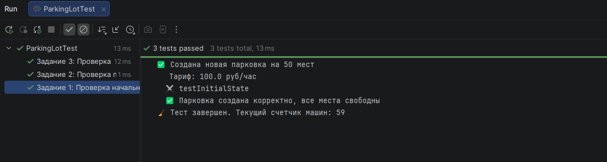
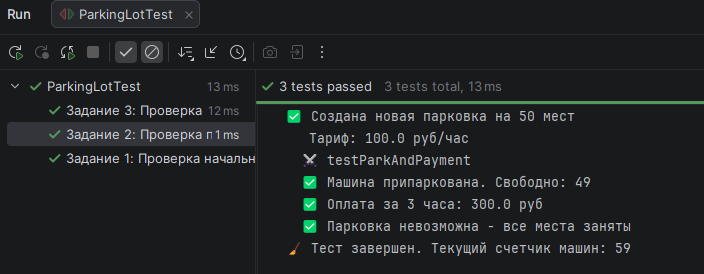
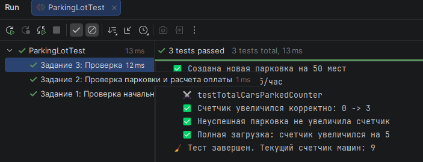
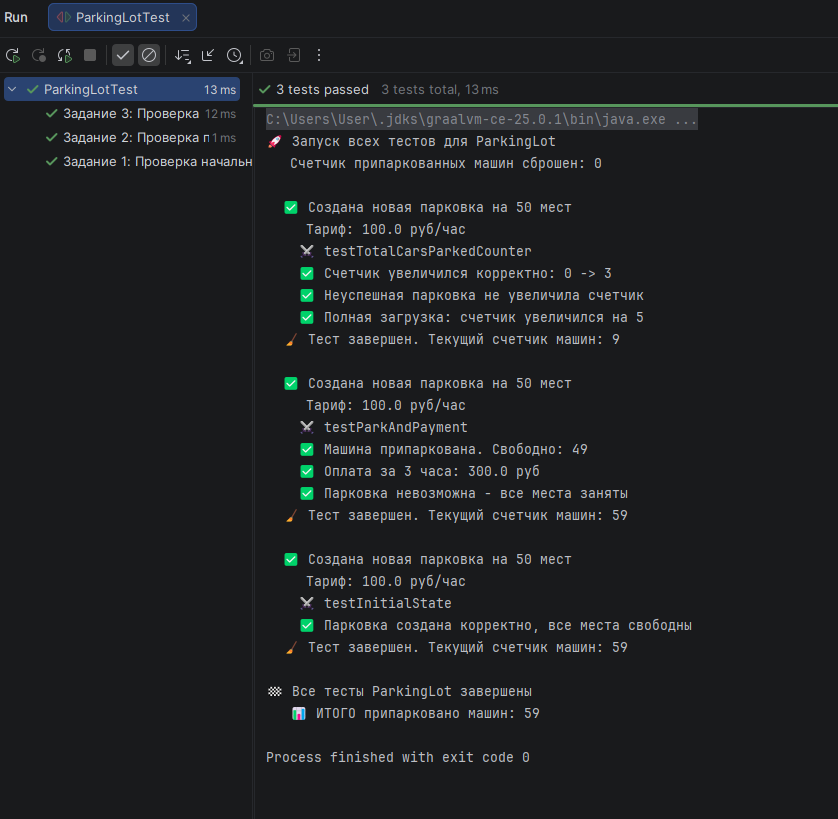
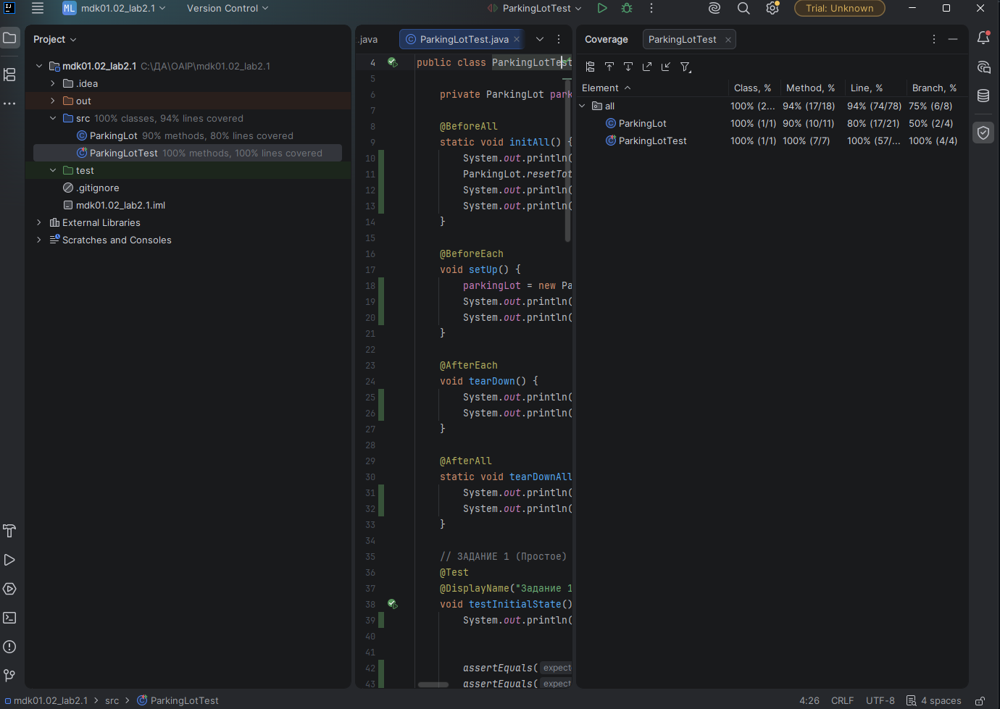

# Лабораторная работа №2_1: Тестовое окружение в JUnit

## 👨🎓 Студент
- **ФИО:** Самсонов Юрий Александрович
- **Группа:** ИС-247
- **Вариант:** 26 (Парковка)

---

## ✅ Выполненные задания

### Задание 1 (Простое)
**Тест:** Используйте @BeforeEach для создания парковки на 50 мест. Проверьте, что свободно 50 мест.

### Задание 2 (Среднее)
**Тесты:** 

Проверьте въезд и выезд. Напишите два теста с использованием @BeforeEach:

- Парковка одной машины (свободных мест становится 49).
- Расчет оплаты за 3 часа при тарифе 100 руб/час (должно быть 300).

### Задание 3 (Сложное)
**Тест:**  Введите статический счетчик totalCarsParked (общее количество припаркованных машин). 
С помощью @BeforeAll инициализируйте счетчик = 0.
Каждый успешный вызов parkCar должен увеличивать счетчик на 1.
С помощью @AfterEach проверяйте увеличение счетчика.
С помощью @AfterAll выведите общее количество припаркованных машин.

---

## 📊 Результаты

---

## 📎 Ссылки
- [Код тестов](src/ParkingLotTest.java)
- [Основной класс](src/ParkingLot.java)

*Дата: 24.06.2026*# lab-junit-cycles-Samsonov
